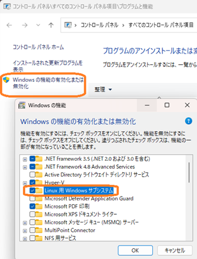

# InstallingWSLEmbeddedLinux
Installing an Embedded Linux Environment Using WSL

[【特別企画】～i.MX8で学ぶ～ 組み込みLinuxハンズオン・セミナ](https://interface.cqpub.co.jp/linux-hands-on/)

[テーマ②：Linuxデバイス・ドライバ開発入門](https://seminar.cqpub.co.jp/ccm/ES24-0111)

公開先：
[https://ahidaka.github.io/InstallingWSLEmbeddedLinux/](https://ahidaka.github.io/InstallingWSLEmbeddedLinux/)

ソース：
[https://github.com/ahidaka/InstallingWSLEmbeddedLinux/](https://github.com/ahidaka/InstallingWSLEmbeddedLinux/)

この資料は必要に応じて更新する場合があります。ご注意ください。


## Linuxデバイス・ドライバ開発入門 ハンズオン環境インストール方法の解説

WSL2 Ubuntu-20.04 を使用する デバイス・ドライバ開発ハンズオンセミナ配布用のWSL2イメージを使用して、ハンズオン環境のインストールと準備方法を示します。

ハンズオン参加者は必ずこの手順に従った準備をお願いします。
このハンズオン環境構築には約1日近くの時間がかかりますが、ハンズオンセミナで役立つ内容を含むので、参加者ご自身での事前準備をお願いします。

**PC環境やインターネットのダウンロード速度に大きく依存しますが、準備には最低1日、環境によっては2～3日かかります。事前に十分な余裕を持って用意をお願いします。**

なおこのハンズオンセミナではWSL1を利用しないため、以降はWSL2のことをWSLと表記します。

## 準備

次の条件を満たすノート型、またはデスクトップPCを用意します。
ハンズオンセミナではUSBケーブル、及びLANケーブルを介してターゲットデバイスへのデータ送信操作があるため、仮想環境の利用は想定していません。
また搭載メモリーが少なく、CPUとディスクが遅い非力な環境ほど、各処理に時間がかかるのでご注意ください。

- Windows 10 / 11 64bit版
- Cドライブ（SSD推奨）の空き容量が150GB以上
- 上記とは別に135GBの作業用ディスク領域（次項参照）
- 2コア2スレッド以上のCPU
- メモリー容量8GB以上（推奨16GB以上）

### ディスクスペース

ハンズオンで使用するWSLイメージのインストール領域として、Cドライブに150GB以上の容量が必要です。
それとは別にダウンロードとイメージ展開用に、約135GBの作業用ストレージが必要です。

次の作業をするので、ご自身の環境に合わせて判断して用意してください。
作業概要と注意事項を示します。

1. 最初に37.1GBの容量(39,880,894,405 バイト)のzip圧縮イメージをダウンロードします。
2. 圧縮イメージを伸張すると96.9GB(104,102,297,600 バイト)のtarファイルに展開されます。
3. 展開後は元のzipファイルは不要なので、削除可能です。
4. Windowsコマンドプロンプトの 'WSL import' コマンドでtarファイルからCドライブにWSLイメージをインポートします。この時に前項で展開したtarファイルを参照します。
5. インポート完了後、tarファイルとzipファイルは不要なので、削除可能です。
6. 一般的なHDDの D:ドライブからSSDのCドライブへのインポート操作には約1時間かかります。
7. インポートするtarファイルは、ハンズオンで使用する圧縮された WSL仮想ディスクイメージです。
8. 低速でトラブルが多いUSBフラッシュメモリー、SDカード、NASやUSB外部ストレージの利用はお勧めしません。

## WSL環境の構築

事前に次の手順でWSLをインストールして動作を確認しておきます。
すでにWSLをインストール済の場合は、以下を参考にして動作確認をしておいてください。

### 仮想環境の条件確認

BIOSを起動して、次の条件を確認します。

- BIOSの最新版への更新
- ハードウェア仮想化オプションの有効化

ハードウェア仮想化オプションは、PC機種によって異なります。
以下を参考にして、ご自身で調べて有効化の確認をお願いします。

BIOS仮想化オプション設定項目名：
```
Intel: VMX または VTx, VTT, VT-d など
AMD: SVM Mode または AMD-V など
```
### bash.exe のインストール

ハンズオンでは使用しませんが、コントロールパネルで操作して「Linux 用 Windows サブシステム」を有効化します。これにより bash.exe がインストールされ、トラブル時などに利用できます。




### インストールと動作確認

WSLを実際にインストールして動作確認します。

#### 状態とオプション確認

WSL状態表示コマンドで現在の状態を確認します。
```
> wsl -l –v  
```
インストール可能な wsl ディストリビューション一覧を表示します。 

```
> wsl --list –online 
```
#### WSL更新

WSLモジュールを最新版に更新します。
```
> wsl --update 
```
#### インストール

次のコマンドで、ディストリビューション一覧にある、Ubuntu 20.04 をインストールします。

```
> wsl --install Ubuntu-20.04
```
インストール完了時、にユーザー名とパスワードを入力します。
インストール後、再起動が必要な場合があります。

#### 動作確認

インストール後、作成したユーザー名でログインして以下のコマンドを実行して、ネットワークが正常動作することを確認します。

```sh
$ sudo apt update 
$ sudo apt upgrade
```
ハンズオンセミナでは、このインストールしたWSL環境は使用しません。
WSLのインポート前の動作確認と、トラブル発生時の動作確認時のに起動して利用します。

## ハンズオンイメージのインポート

ハンズオンイメージを入手、展開、インポートでインストールします。

### ダウンロード

以下からハンズオン環境用のWSL圧縮イメージをダウンロードしておきます。
**約40GB あります。大容量なので注意してください。**

ダウンロード URL（弊社運営オンラインショップ）:

[**https://shop.dics.net/eshop/temp/train01.zip**](https://shop.dics.net/eshop/temp/train01.zip)

### 展開

任意の場所で、ダウンロードしたzipファイルをダブルクリックして展開します。
次の点に注意してください。
- train01.zip は、37.1GB あります。
- 展開して作成される train01.tar ファイルの容量は96.9GB です。
- train01.tar ファイルはこの後、WSL環境構築のインポートファイルとして使用します。

### インポート

次の手順で、前項で展開して作成した train01.tar ファイルをインポートします。

次のコマンドで、WSLを全て停止します。

```cmd
> wsl --shutdown
```

### インポート

次に、コマンドを実行してハンズオン用 WSLイメージを展開します。

```cmd
importの一般的な形式は次の通りです。
> wsl --import ＜ディストリビューション名＞ <配置先> ＜インポートtarイメージ＞
```
例えば次のコマンドで実行します。

```cmd
> wsl --import Ubuntu-20.04cq "%LOCALAPPDATA%\CQHandsOn-01" "D:\WSL\train01.tar"
```
- Ubuntu-20.04cq はハンズオンで使用する便宜的な名前です。
- %LOCALAPPDATA%\CQHandsOn-01 はハンズオンで使用するフォルダー名です。
- 実際の所在は、C:\Users\<ユーザーフォルダー名>\AppData\Local となります。
- HDDのD:ドライブからSSDのCドライブへのインポート操作に約1時間かかります。

## ハンズオン環境の設定

インポート完了は、「この操作を正しく終了しました。」のメッセージを確認します。

### 状態を確認します。

最初にWSLの状況を確認します。

```cmd
> wsl -l -v
```
次の様に、「Ubuntu-20.04」「Ubuntu-20.04cq」が「Stopped」状態で表示されていることを確認します。

```cmd
  NAME              STATE           VERSION
* Ubuntu-20.04      Stopped         1
  Ubuntu-20.04cq    Stopped         2
```

### デフォルト・ディストリビューション

次のコマンドでWSLのデフォルト・ディストリビューションを設定します。

```cmd
> wsl --set-default Ubuntu-20.04cq
```

デフォルトディストリビューションの変更を確認します。
```cmd
> wsl -l -v
```
で現在のデフォルト・ディストリビューションが、Ubuntu-20.04cq であることを確認して、WSLを起動してログインします。
```cmd
> wsl
```

### デフォルト・ユーザー

インポート直後はルートユーザーでのログインとなるので、以下の手順で　/etc/wsl.conf にデフォルトユーザーを設定します。

```sh
# cat >> /etc/wsl.conf
```

入力内容（cat コマンドの入力に貼り付けます）

```sh
[user]
default=train
```

#### wsl.conf 内容確認

wsl.conf の内容を確認し、必要があればエディタで修正します。

```sh
# cat /etc/wsl.conf
```
次の内容になっていることを確認します。

```sh
[boot]
systemd=true
[user]
default=train
```

再起動後、再度ログインしてデフォルトユーザーの設定を確認します。

```sh
# shutdown -r now
```

#### デフォルトユーザー確認

再起動し直して少し待ってログインし、**train** ユーザーでログインすることを確認します。
```cmd
> wsl
```

### 動作確認

インポート環境の動作を確認します。

#### ネットワークと最新状態の確認

次のコマンドで確認します。

```cmd
$ sudo apt update
$ sudo apt upgrade
```

必要に応じて'Y'入力して更新します。

#### クロスコンパイラの状態の確認

次のコマンドで確認します。

```sh
$ cd ~/toolchain/arm-gnu-toolchain-12.2.rel1-x86_64-aarch64-none-linux-gnu/bin/
$ ./aarch64-none-linux-gnu-gcc -v
```
を実行して次の様に表示されることを確認します。

```sh
...
一部省略
...
in for the A-profile Architecture 10.3-2021.07 (arm-10.29)'
Thread model: posix
Supported LTO compression algorithms: zlib
gcc version 12.2.1 20221205 (Arm GNU Toolchain 12.2.Rel1 (Build arm-12.24))
```

## ハンズオン環境の動作確認

ここまで実行して、最後の **aarch64-none-linux-gnu-gcc -v** の表示の確認をしてください。
表示が確認出来れば準備が完了です。

異常がある場合は作業を見直して、ハンズオン当日までに必ず動作確認をお願いします。

### トラブル対応

イメージインポートにおいて、インポート先のCドライブの容量が足りない場合は、Import操作が終了しません。
コントロールCでコマンド中断後、wsl の停止を確認して、%LOCALAPPDATA%\CQHandsOn-01 フォルダーを削除、Cドライブの空き領域を拡張してから、次のコマンドでインストール済ディストリビューションを削除します。
```cmd
> wsl --unregister Ubuntu-20.04cq
```
その後念のため再起動してから、WSLの停止を確認して再度インポートを実行します。

### 削除

ハンズオン終了後の使用しなくなったWSLイメージの削除は、前項のトラブル対応とほぼ同じです。

wsl の停止を確認して、%LOCALAPPDATA%\CQHandsOn-01 フォルダーを削除、次のコマンドでインストール済ディストリビューションを削除します。
```cmd
> wsl --unregister Ubuntu-20.04cq
```

## その他の情報

組み込みLinuxでのWSL利用に関する追加情報です。

### WSLへのリモートアクセス

セミナーでは利用しませんが、WSLに他のPCからネットワーク経由でリモートアクセス可能にしておくと便利です。

#### 設定手順

Windows の管理者権限のPowerShell で、次の6行のコマンドを順番に実行します。

1. サービス状態確認

   OpenSSHサービス状態を確認します。
```cmd
> Get-WindowsCapability -Online | ? Name -like 'OpenSSH*'
```

2. OpenSSHサービスインストール（5～10分ぐらい時間がかかります）
```cmd
> Add-WindowsCapability -Online -Name OpenSSH.Server~~~~0.0.1.0
```

3. sshd サービスを起動
```cmd
> Start-Service sshd
```

4. 有効化状態を確認し、スタートアップ起動を設定します。
```cmd
> Get-Service sshd
> Set-Service -Name sshd -StartupType 'Automatic'
```

5. OpenSSH サインイン シェルにWSL bash.exe を設定します。この設定をしないとPowerShellが割り当てられます。
```cmd
> New-ItemProperty -Path "HKLM:\SOFTWARE\OpenSSH" -Name DefaultShell   -Value "C:\WINDOWS\System32\bash.exe" -PropertyType String -Force
```

リモートからWSLにアクセスするためには、Windows の対象アカウントにパスワード設定が必要な点に注意が必要です。


#### 関連情報

- 前記リモートアクセス設定のYouTune 動画（途中から始まります）

    https://youtu.be/S78OAxQjPoA&t=513

- 関連の SlideShare スライド

    https://www.slideshare.net/slideshow/tips-and-tricks-for-wsl-users-two-easy-and-reliable-ways-to-get-started-with-openssl-server/271345097

以上
